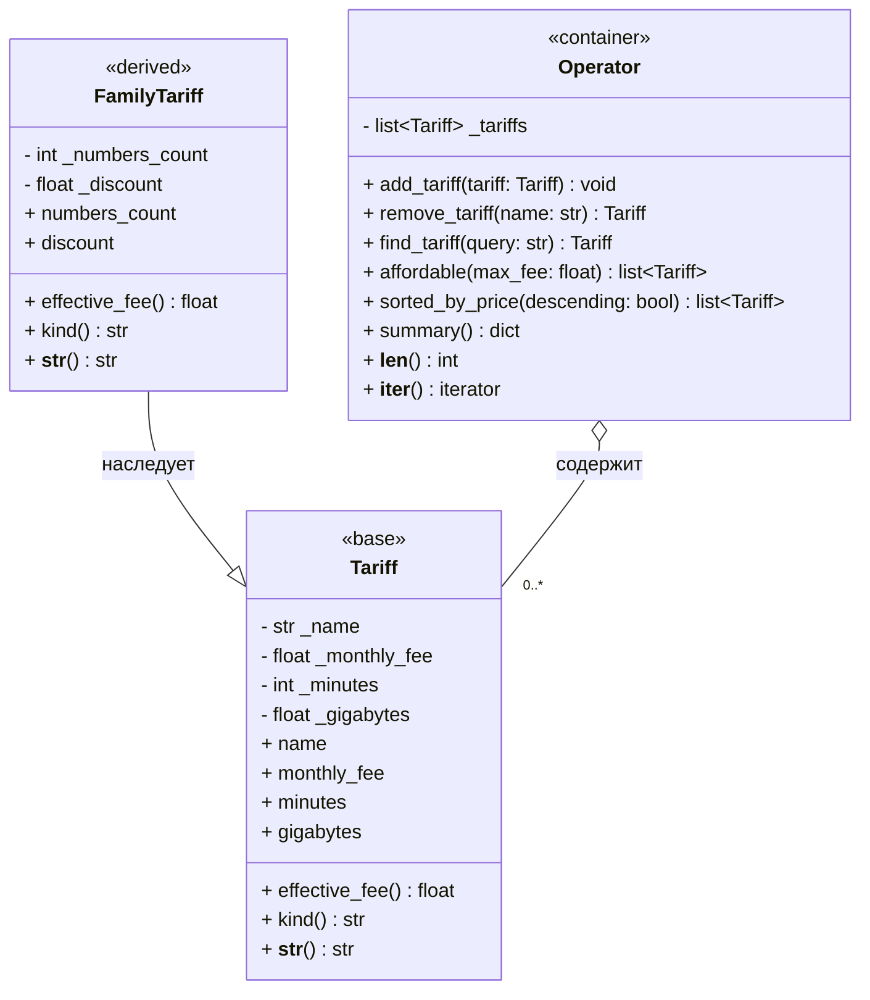
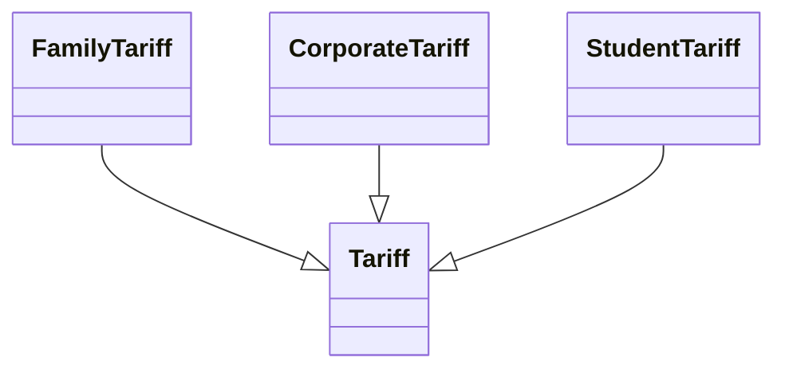

# Вариант 30. Сотовая связь — тарифные планы

Файл описывает модель классов для самостоятельного задания по ООП.  
Основная цель модели — показать инкапсуляцию, наследование, полиморфизм, контейнер-агрегат, демонстрацию работы методов и обработку ошибок через валидацию свойств.

## 1. Назначение модели

Предметная область — линейка тарифных планов оператора сотовой связи.

В модели выделены три основные сущности:

- `Tariff` — базовый класс обычного тарифного плана.
- `FamilyTariff` — наследник `Tariff`, описывающий семейный тариф.
- `Operator` — контейнер-агрегат, который хранит тарифы и предоставляет методы поиска, удаления, сортировки и получения статистики.

Такое разделение позволяет не дублировать общие поля и методы тарифов, а различия между видами тарифов выразить через наследование и переопределение методов.

## 2. Диаграмма классов



## 3. Описание классов

### 3.1. `Tariff`

`Tariff` — базовый класс тарифного плана.

Он хранит общие характеристики, которые есть у любого тарифа:

| Поле | Назначение |
|---|---|
| `_name` | Название тарифного плана |
| `_monthly_fee` | Абонентская плата |
| `_minutes` | Количество минут в пакете |
| `_gigabytes` | Количество гигабайт интернета |

Поля являются защищёнными по соглашению Python: они начинаются с `_`.  
Доступ к ним должен выполняться через свойства (`property`) и сеттеры.

Это важно для инкапсуляции: внешний код не должен напрямую менять внутреннее состояние объекта. Например, нельзя допустить тариф с отрицательной абонентской платой или отрицательным числом минут.

Основные методы класса:

| Метод | Назначение |
|---|---|
| `effective_fee()` | Возвращает реально списываемую сумму. Для обычного тарифа это просто `monthly_fee`. |
| `kind()` | Возвращает тип тарифа, например `"обычный"`. |
| `__str__()` | Возвращает строковое представление тарифа для вывода в консоль, таблицу или GUI. |

## 4. Наследование: `FamilyTariff(Tariff)`

`FamilyTariff` — это семейный тариф, то есть частный случай обычного тарифа.

Он наследует от `Tariff`, потому что семейный тариф тоже имеет:

- название;
- абонентскую плату;
- пакет минут;
- пакет гигабайт;
- строковое представление;
- расчёт итоговой стоимости.

Дополнительно семейный тариф содержит два собственных поля:

| Поле | Назначение |
|---|---|
| `_numbers_count` | Количество номеров в семейном тарифе. Значение должно быть не меньше 2. |
| `_discount` | Скидка в процентах. Значение должно быть в диапазоне от 0 до 100. |

### Почему здесь нужно наследование

Связь между `FamilyTariff` и `Tariff` — это отношение **is-a**:

> `FamilyTariff` является тарифом.

Поэтому наследование подходит лучше, чем отдельный независимый класс.  
Везде, где программа ожидает объект `Tariff`, можно передать объект `FamilyTariff`.

Например, контейнер `Operator` хранит список `Tariff`, но в этом списке могут находиться и обычные тарифы, и семейные тарифы.

## 5. Переопределение методов и полиморфизм

Главное отличие семейного тарифа от обычного — формула расчёта итоговой стоимости.

Для обычного тарифа:

```text
effective_fee = monthly_fee
```

Для семейного тарифа:

```text
effective_fee = monthly_fee × numbers_count × (1 - discount / 100)
```

Поэтому `FamilyTariff` переопределяет метод `effective_fee()`.

Это пример полиморфизма: контейнер `Operator` может вызвать один и тот же метод `t.effective_fee()` для любого тарифа, не проверяя его конкретный тип.

Например:

```text
для Tariff        → effective_fee() вернёт обычную абонентскую плату;
для FamilyTariff  → effective_fee() вернёт стоимость всех номеров с учётом скидки.
```

Благодаря этому в методах `affordable()` и `sorted_by_price()` не нужны проверки вида `if isinstance(...)`.  
Каждый объект сам знает, как правильно рассчитать свою стоимость.

## 6. Контейнер-агрегат `Operator`

`Operator` — это не тариф. Он не должен наследоваться от `Tariff`.

`Operator` описывает оператора связи или его линейку тарифов. Он содержит список тарифов:

```text
_tariffs: list[Tariff]
```

Это отношение называется **has-a** или агрегация:

> `Operator` содержит тарифы.

На диаграмме Mermaid это показано связью:

```text
Operator o-- "0..*" Tariff
```

Символ `o--` означает агрегацию, то есть объект-контейнер хранит другие объекты.

Основные методы контейнера:

| Метод | Назначение |
|---|---|
| `add_tariff(tariff)` | Добавляет тариф в список. |
| `remove_tariff(name)` | Удаляет тариф по названию и возвращает удалённый объект. |
| `find_tariff(query)` | Ищет тариф по названию или части названия. |
| `affordable(max_fee)` | Возвращает тарифы, у которых итоговая стоимость не превышает заданный максимум. |
| `sorted_by_price(descending=False)` | Возвращает тарифы, отсортированные по итоговой стоимости. |
| `summary()` | Возвращает статистику по тарифам. |
| `__len__()` | Позволяет использовать `len(operator)`. |
| `__iter__()` | Позволяет перебирать тарифы через `for t in operator`. |

## 7. Почему `Operator` не наследуется от `list`

Можно было бы сделать `Operator` наследником `list`, но это плохое решение.

Если `Operator` наследуется от `list`, внешний код сможет напрямую изменять содержимое контейнера:

```text
operator[0] = "не тариф"
```

Такой код нарушит целостность модели.

Правильнее хранить список внутри объекта:

```text
self._tariffs = []
```

И давать доступ к нему только через методы `add_tariff`, `remove_tariff`, `find_tariff` и другие.

Такой подход защищает инварианты модели:

- в контейнер можно добавить только тариф;
- можно проверять уникальность названий;
- можно централизованно обрабатывать ошибки;
- внешний код не ломает внутреннюю структуру объекта.

## 8. Валидация и обработка исключений

В модели обязательно используются свойства и сеттеры.

Сеттеры должны проверять корректность вводимых данных:

| Свойство | Проверка |
|---|---|
| `name` | Строка не должна быть пустой. |
| `monthly_fee` | Число, не меньше 0. |
| `minutes` | Целое число, не меньше 0. |
| `gigabytes` | Число, не меньше 0. |
| `numbers_count` | Целое число, не меньше 2. |
| `discount` | Число от 0 до 100. |

Если пользователь вводит некорректные данные, сеттер должен выбросить исключение:

- `TypeError`, если передан неправильный тип;
- `ValueError`, если значение имеет неправильный диапазон.

Это особенно удобно для будущего GUI: графический интерфейс сможет перехватывать такие исключения и показывать пользователю сообщение об ошибке.

Например:

```text
messagebox.showerror("Ошибка ввода", str(error))
```

## 9. Связь модели с будущим GUI

Модель заранее подготовлена к использованию в графическом интерфейсе.

| Элемент GUI | Метод модели |
|---|---|
| Кнопка «Добавить тариф» | `operator.add_tariff(Tariff(...))` или `operator.add_tariff(FamilyTariff(...))` |
| Кнопка «Удалить выбранный» | `operator.remove_tariff(selected_name)` |
| Поле поиска и кнопка «Найти» | `operator.find_tariff(query)` |
| Слайдер «Макс. цена» | `operator.affordable(max_fee)` |
| Чекбокс «Только доступные» | `operator.affordable(max_fee)` |
| Клик по заголовку столбца «Цена» | `operator.sorted_by_price(descending=...)` |
| Панель статистики внизу окна | `operator.summary()` |
| Заполнение `Listbox` или `Treeview` | `for t in operator: ...` |

Методы `__len__()` и `__iter__()` делают контейнер удобным для GUI.  
Например, при открытии окна можно перебрать все тарифы и вставить их в таблицу:

```text
for tariff in operator:
    tree.insert(..., values=str(tariff))
```

## 10. Обоснование выбранной иерархии

### 10.1. Общие свойства вынесены в базовый класс

Обычный и семейный тариф имеют одинаковую основу:

- название;
- абонентскую плату;
- минуты;
- гигабайты;
- проверку значений;
- строковое представление.

Если бы классы `Tariff` и `FamilyTariff` были полностью независимыми, пришлось бы дублировать одинаковый код.

Наследование устраняет это дублирование и соблюдает принцип DRY:

> Don't Repeat Yourself — не повторяйся.

### 10.2. Семейный тариф расширяет обычный тариф

`FamilyTariff` не заменяет `Tariff`, а расширяет его.

Он добавляет:

- количество номеров;
- скидку;
- собственную формулу расчёта итоговой стоимости.

Поэтому он является наследником базового класса.

### 10.3. Контейнер отделён от тарифов

`Operator` не является тарифом. Он управляет набором тарифов.

Поэтому между `Operator` и `Tariff` используется не наследование, а агрегация.

Это делает модель логичной:

```text
FamilyTariff — это Tariff.
Operator содержит Tariff.
```

### 10.4. Модель легко расширять

Если позже потребуется добавить новый тип тарифа, например `CorporateTariff`, достаточно создать новый класс-наследник `Tariff`.

Он сможет переопределить `effective_fee()` и `kind()`, а контейнер `Operator` продолжит работать без изменений.

Пример будущего расширения:



## 11. Итог

Иерархия из трёх классов является минимально достаточной для варианта 30:

```text
Tariff          — базовая сущность тарифного плана;
FamilyTariff    — специализированный семейный тариф;
Operator        — контейнер для хранения и обработки тарифов.
```

Такая структура показывает основные принципы ООП:

- инкапсуляцию через защищённые поля и свойства;
- наследование через `FamilyTariff(Tariff)`;
- полиморфизм через переопределение `effective_fee()`;
- агрегацию через `Operator`, который содержит список тарифов;
- подготовку модели к GUI;
- обработку ошибок через исключения в сеттерах.

Выбранная архитектура не только соответствует условию задания, но и позволяет легко развивать программу: добавлять новые виды тарифов, подключать графический интерфейс и расширять методы контейнера.
